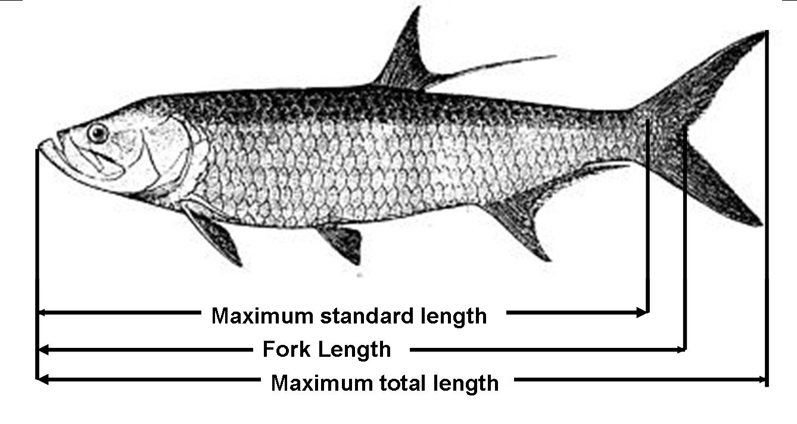

Machine Learning Homework Requirements:

Hello! Welcome to the famous Tsukiji fish market of Tokyo, Japan! We came here to collect data on some of the fish they have here 
but we didn't wake up at 5am for the tuna auction and by the time we showed up they were only left with a few species of fish. 
We got to work and gathered measurements from a few different species of fish and want you to train a regression model to predict
the weight of a fish using some of the features we were able to measure. We have no idea which features will be good predictors. 

We will hold out 30% of the data before we hand it to you and we will use that csv for scoring.

Here's what we need from you:
1. A function that accepts a csv path and returns the predictions of your regression model using our csv. The csv we use will contain all the columns. 
2. Use a pipenv and scikit learn to submit the final hw. You may use R for model selection. 

With this function and it's output, we will rank the students by how well their model performed on predicting weight based on naive data. 

Your grade will be determined by ranking according to Mean-squared Error.

If your function does not return a list of predictions or we cannot compute the accuracy of your model that it will be an automatic F. 